# LINE 群組健康度分診系統

自動分析 LINE 工作群組對話，計算多維度健康指標，產出 PDF 優先處理報告。

## 功能概覽

- **I1** 未回應提問年齡（業務時間感知）
- **I2** 客戶回應延遲 P90（業務時間計算）
- **I3** 最老未解議題年齡（Claude LLM 抽取，選用）
- **I4** 客戶負面情緒比例（72h 視窗、情緒狀態標籤）
- **I5** 近 24h 訊息量
- **I6** 語義熵時間序列（Semantic Entropy，對話主題複雜度追蹤）
- **Tripwire** 非補償性升級偵測（退款 / 投訴 / 找主管等關鍵詞）
- 自動產出 PDF 總覽報告（群組排名 + 各群組逐項分析 + I6 sparkline 圖表）

---

## 範例報告

以下為 10 個工作群組的實際分析輸出（使用去識別化 pseudo 對話）。

📄 [下載完整 PDF 報告](docs/sample_report/sample_report.pdf)

### 第 1 頁 — 群組總覽與排名

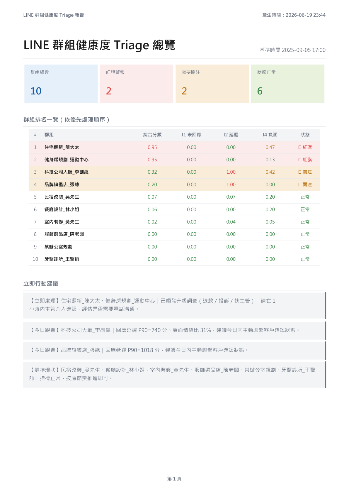

### 第 2 頁 — 最高風險群組詳細分析

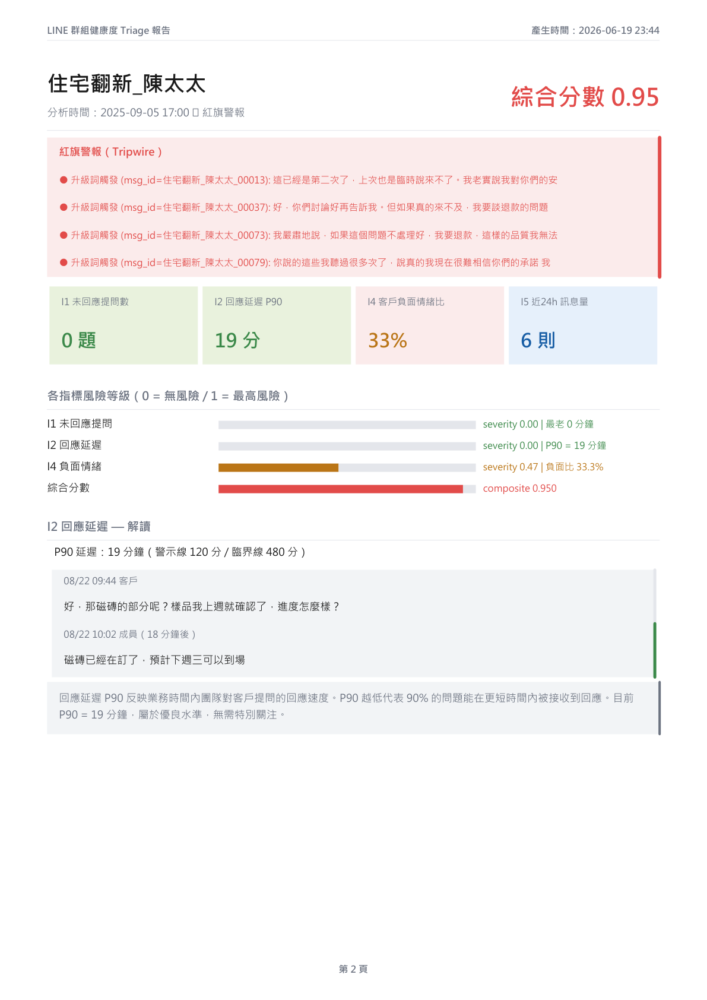

### 第 3 頁 — I6 語義熵 sparkline 範例（健身房規劃群組）

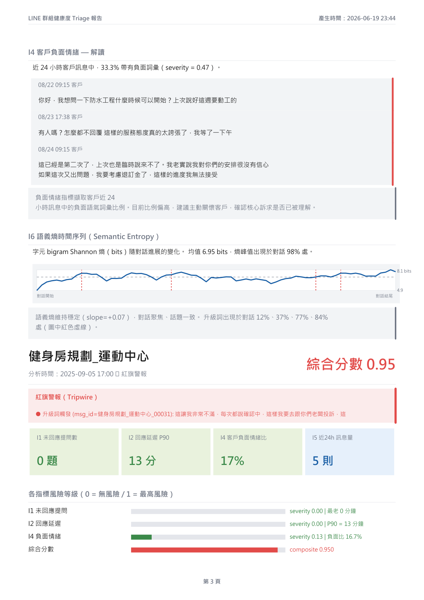

### 第 4–5 頁 — 中風險群組分析

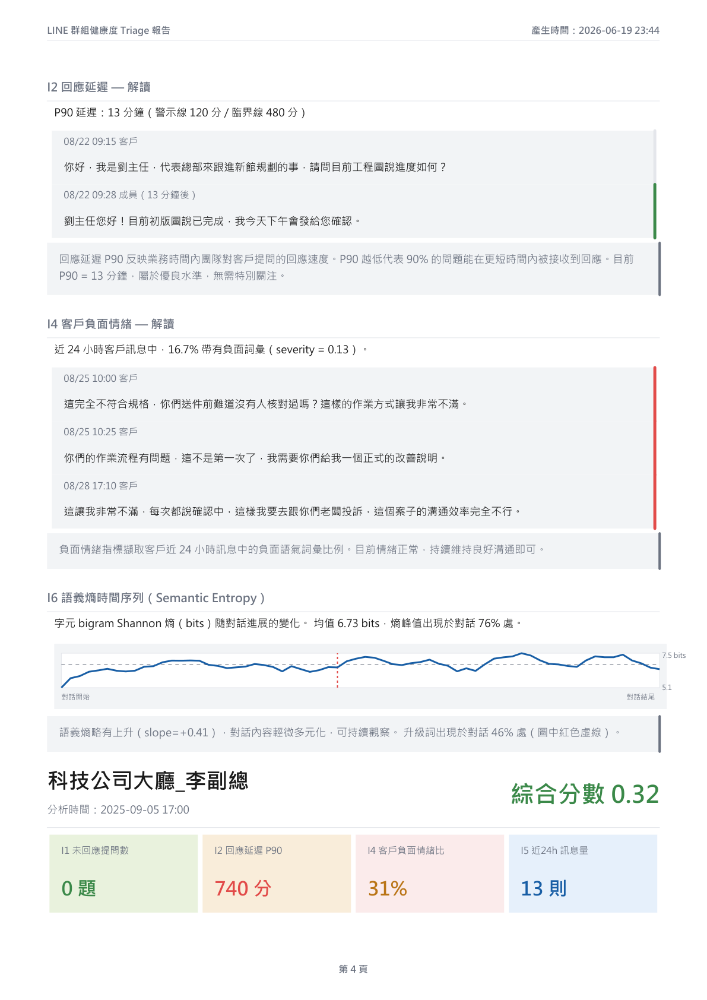

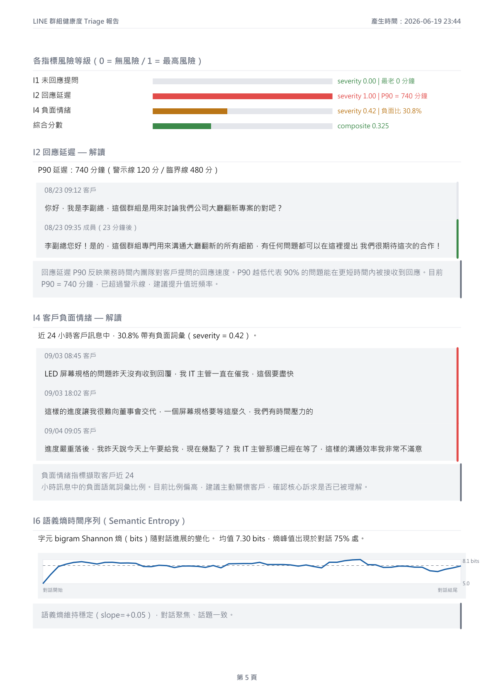

<details>
<summary>📋 查看剩餘 9 頁（點擊展開）</summary>

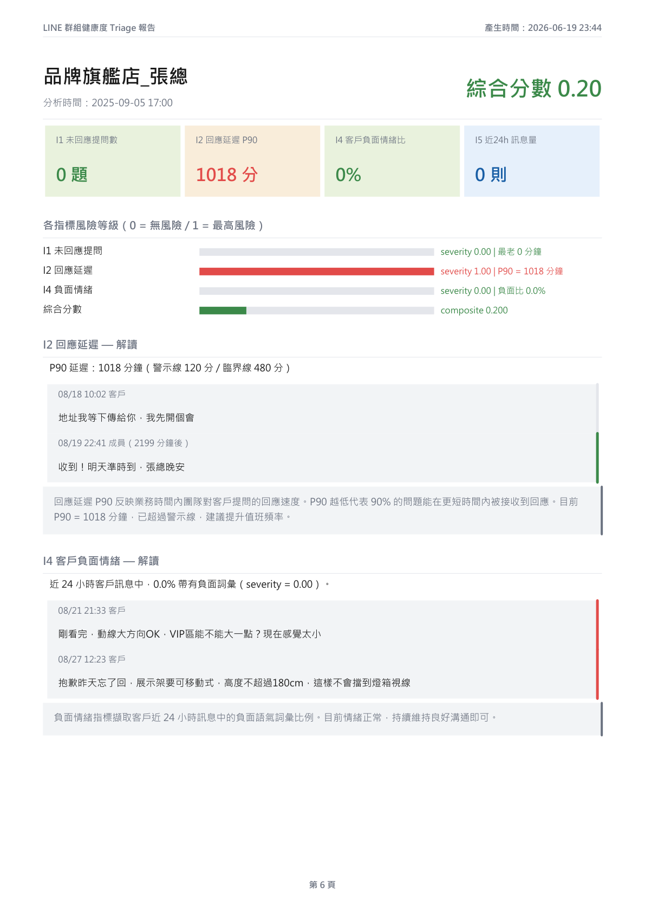
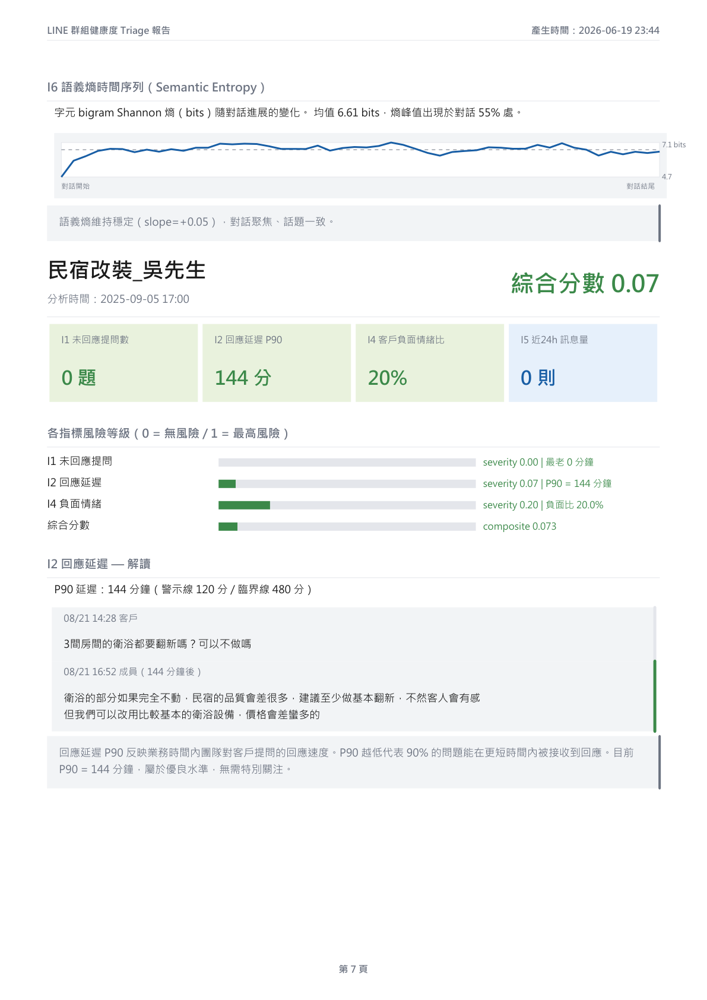
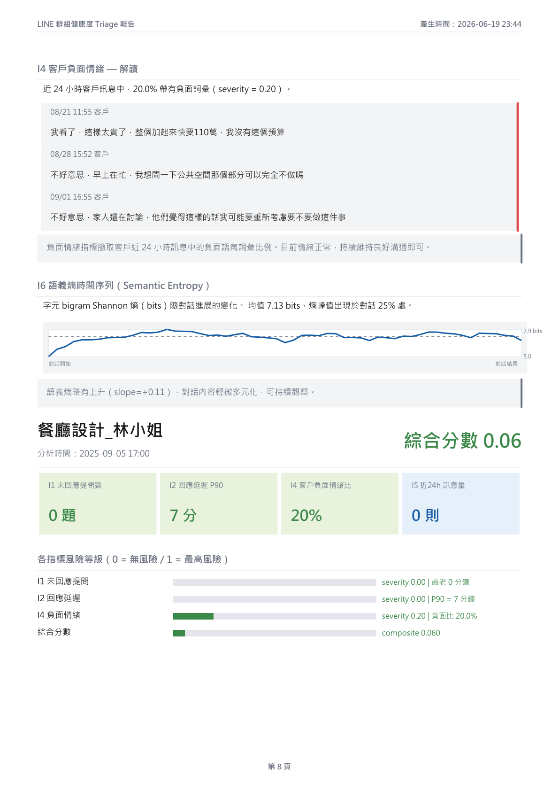
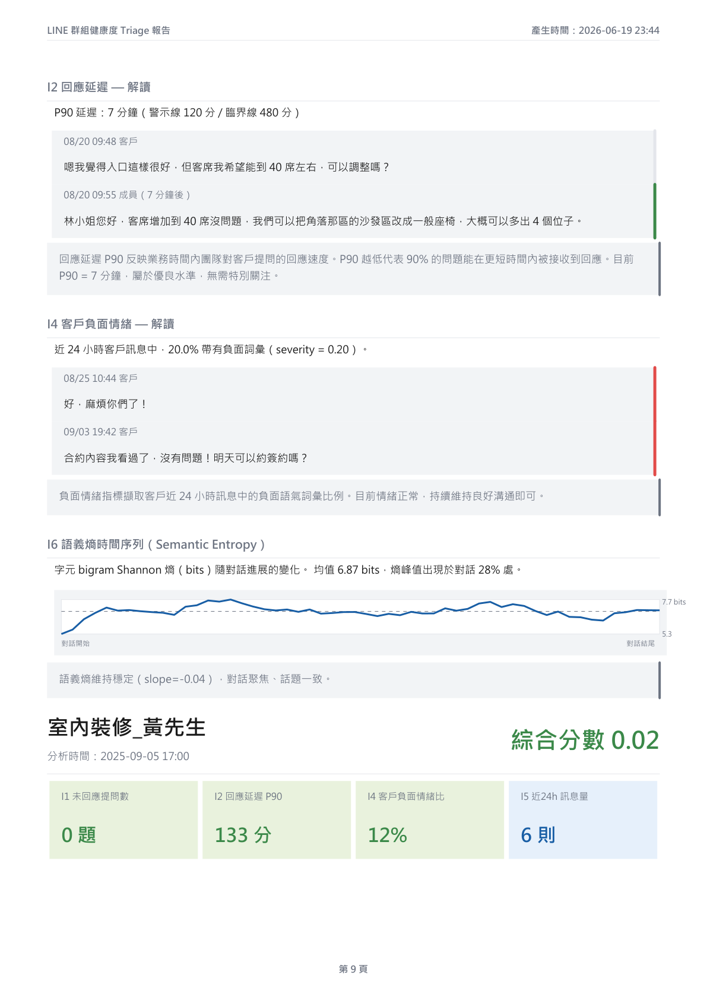
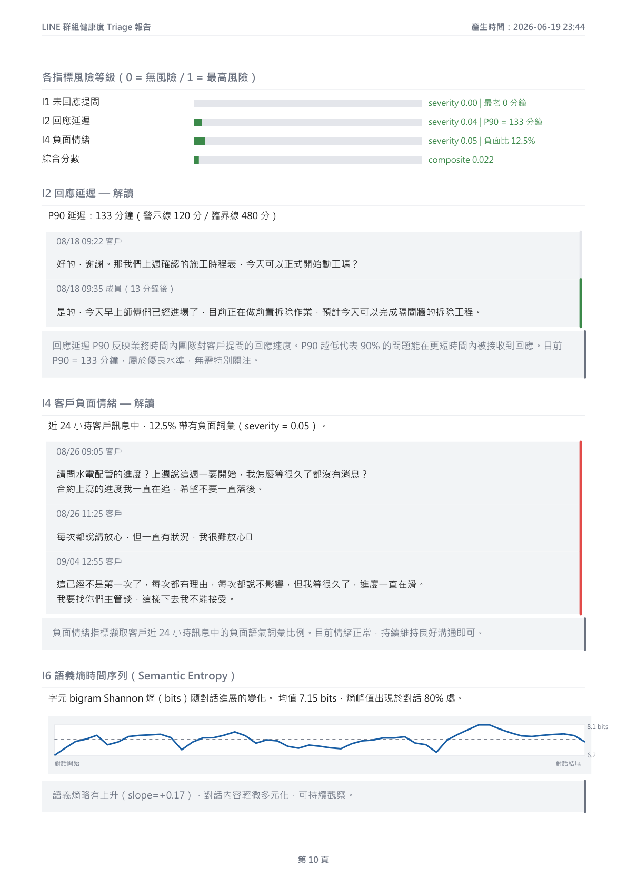
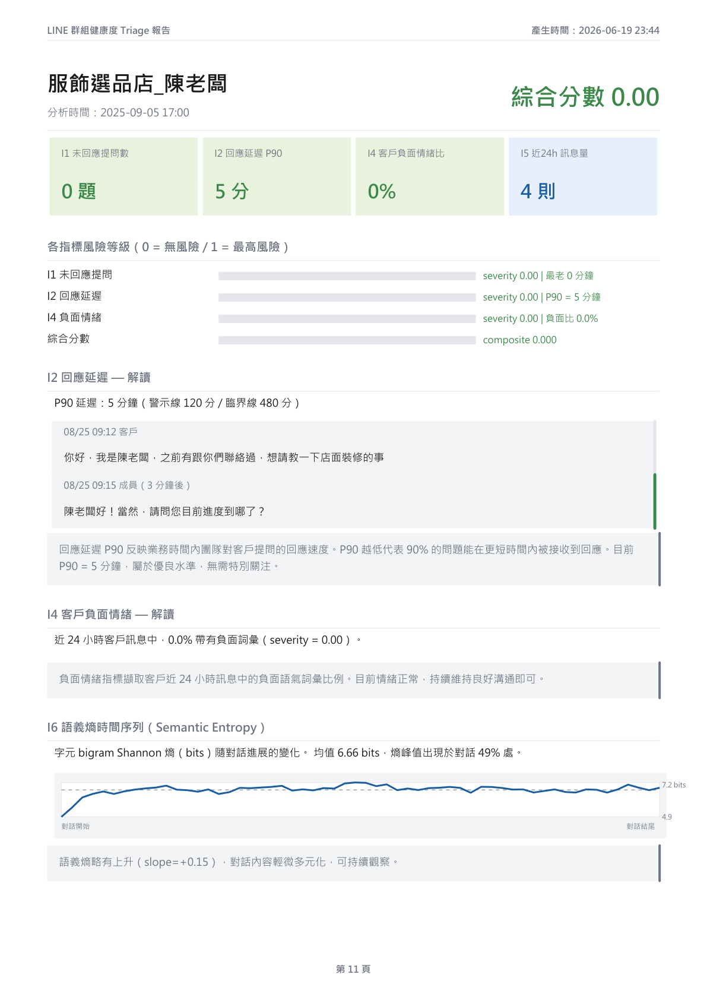
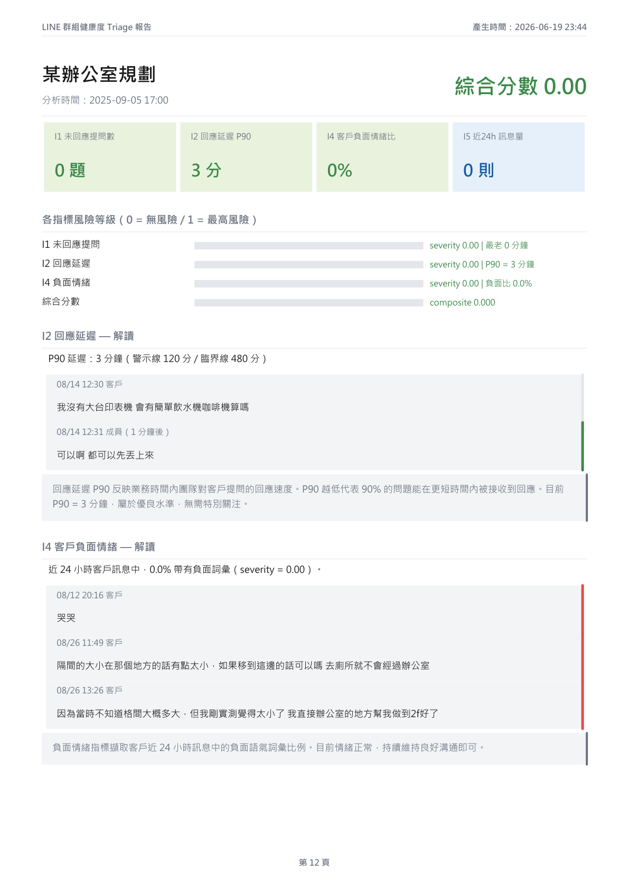
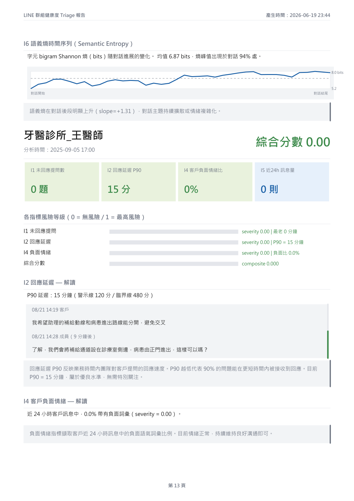


</details>

---

## 快速開始

### 安裝依賴

```bash
pip install -r requirements.txt
```

### 準備資料

1. 將 LINE 匯出的對話 `.txt` 檔放入 `data/conversations/`
2. 編輯 `data/employees.txt`，每行填入一位員工顯示名稱

`employees.txt` 格式：
```
成員A
成員B
成員C
```

### 執行

```bash
# 基本執行（以目前時間為基準）
python main.py

# 指定基準時間（模擬/回測）
python main.py --now 2025-09-05T17:00

# 產出 PDF 報告
python main.py --now 2025-09-05T17:00 --report

# 啟用 LLM 議題抽取（需 ANTHROPIC_API_KEY）
python main.py --report --llm --llm-threshold 0.3

# 指定對話資料夾與報告輸出目錄
python main.py --conversations data/conversations --report-dir reports
```

### 測試

```bash
pip install pytest httpx
python -m pytest
```

### 匯入 Telegram 群組歷史

1. 電腦版 Telegram Desktop →「設定」→「進階」→「匯出 Telegram 資料」
2. 只勾選需要的群組類型（私人群組／公開群組），格式選 **JSON**，媒體檔可全部取消勾選
3. 將匯出資料夾放到 `data/telegram/`（已排除於版控），列出成員 id 以填寫 `employees.txt`：
   ```bash
   python -X utf8 -m src.telegram_export data/telegram
   ```
   `employees.txt` 可填顯示名稱，或 Telegram id（如 `user123456789`，改名也不受影響）
4. 執行 triage：
   ```bash
   python -X utf8 main.py --telegram-export data/telegram --report
   ```

只處理群組；私訊、頻道、Bot 對話與收藏訊息會自動略過。

### 社群模式（股票社群群組：多空、話題、entropy）

客服 triage 以外的第二種模式，針對大型投資社群群組。流程與資料都在 `data/community/`（已排除於版控）。
目前進度、實驗結果與下一步記錄在 [HANDOFF.md](HANDOFF.md)。

```bash
python -X utf8 -m src.community prepare        # Telegram 匯出 → SQLite（只需一次）
python -X utf8 -m src.community sample         # 分層抽樣（隨機＋加強抽樣），考卷 split 永不用於訓練
python -X utf8 -m src.community label --limit 20             # 地端 Qwen3 標註（Ollama，可中斷續跑）
python -X utf8 -m src.community label --backend claude       # 或改用 Claude Haiku（需 ANTHROPIC_API_KEY）
python -X utf8 -m src.community review-queue   # 待標清單：AI 判多空全收＋中立對照抽樣
python -X utf8 -m src.community annotate --queue  # 本機人工標註網頁 http://127.0.0.1:8770
python -X utf8 -m src.community compare        # 各模型標註 vs 人工標註（分層加權，accuracy / macro-F1 / kappa）
python -X utf8 -m src.community train --labels qwen3-8b --test-labels human --show-features
python -X utf8 -m src.community label --model phi4 --prompt v3 --queue      # 只標待標清單，新提示詞 / 模型可直接和人工比較
python -X utf8 -m src.community critique --labels qwen3-8b-v3 --model phi4 --queue  # AI 批改迴圈（RLAIF 式，不訓練）
python -X utf8 -m src.community series --freq 4h --stance-labels qwen3-8b-v2  # 每時間窗的訊息量、標的 entropy、話題轉移、多空
python -X utf8 -m src.community predict --freq 4h   # 預測下一時間窗的爆量 / 話題轉移 / 情緒反轉
```

標註來源存成 `data/community/labels/<名稱>.jsonl`：模型以模型名命名（如 `qwen3-8b`），人工標註為 `human`。
分類器（`src/community/classifier.py`）介面為 `fit` / `predict_proba`，可替換為其他模型（如 Jev）在同一份考卷上比較。

#### 多空標註結果（2026-10-06，人工標註 165 則完成）

資料：2 個 Telegram 股票社群，共約 109 萬則訊息。人工只標 AI 有爭議的訊息：AI 判有多空的**全部收錄**，AI 判中立的**抽樣作對照組**，
再依分層權重（該層總數 ÷ 已標數）推估整份考卷的分數。隨機考卷（`test`，500 則）與加強考卷（`enrich_test`，200 則，只抽含多空/部位/代號用語的訊息）分開報告。
本 repo 公開，以下只列統計數字，不含任何訊息內容。

**人工標註的分布**

| | 隨機考卷 | 加強考卷 |
|---|---|---|
| AI 判多空的訊息，人工也判有多空 | 23 / 43 | 22 / 48 |
| AI 判中立的對照抽樣，人工判有多空 | 3 / 59 | 0 / 15 |
| 推估有多空立場的比例 | 約 9%（看空約 25、看多約 21 則） | 約 11% |

**LLM 標註器 vs 人工（多空，加權推估）**

| 標註來源 | 考卷 | accuracy | macro-F1 | Cohen's kappa |
|---|---|---|---|---|
| Qwen3 8B 提示詞 v1 | 隨機 | 0.906 | **0.600** | **0.415** |
| Qwen3 8B 提示詞 v2 | 隨機 | 0.912 | 0.561 | 0.394 |
| Qwen3 8B 提示詞 v2 | 加強 | 0.860 | 0.688 | 0.549 |

- **主要錯誤是「誤判有多空」**：AI 判有多空的訊息，人工同意方向的只有約 45%（v1 18/40、v2 14/31、v2 加強 20/48），其餘多半被人工判為中立，少數方向相反。
- **v1 與 v2 大致打平**：v2 減少誤判（AI 多空中被人工判中立：v1 19 則 → v2 12 則），但也漏掉真正的多空，看空召回率約 27% → 20%、看多約 53% → 43%。
  v1 與 v2 意見不同的 15 則中，v2 對 8 則、v1 對 5 則；v2 改成中立的 12 則裡，有 4 則人工判定確實有多空，證實 v2 有矯枉過正。
- 話題分類一致性低（macro-F1 0.22–0.24）：AI 常把閒聊標成個股、新聞或操作部位。
- 隨機考卷中，AI 判中立的 457 則只抽 59 則，其中 3 則人工判有多空，每則權重約 7.7，因此隨機考卷的召回率估計**誤差範圍很大**。

**分類器 vs 人工（多空，加權推估）**：TF-IDF（字元 n-gram）+ 邏輯迴歸，訓練資料為 v2 標註的 `enrich_train` 800 則

| 模型 | 隨機考卷 macro-F1 | 加強考卷 macro-F1 |
|---|---|---|
| 永遠猜中立（基準） | 0.32 | 0.31 |
| TF-IDF + 邏輯迴歸 | 0.41 | 0.65 |

- 加強考卷上看多 / 看空的 F1 約 0.52 / 0.47；隨機考卷上只有 0.22 / 0.07，在真實分布下仍不可用。
- 先前以 v2 標註當答案得到 0.49 / 0.50；改用人工答案後，隨機考卷分數下降，代表訓練標註本身的雜訊是主要瓶頸。

**提示詞 v3、換模型與 AI 批改迴圈（2026-10-07）**：在同一份 165 則人工答案上比較（原始則數）

| 標註來源 | 判多空則數 | 方向與人工相同 | 人工多空 48 則中抓到 | 加權 kappa 隨機 / 加強 |
|---|---|---|---|---|
| Qwen3 8B v2 | 79 | 43% | 34 | 0.394 / 0.549 |
| Qwen3 8B v3 | 62 | 48% | 30 | 0.406 / 0.383 |
| Qwen3 8B v3 + phi4 批改 | 60 | 52% | 31 | 0.271 / 0.278 |
| **phi4 14B v3** | 62 | **55%** | **34** | 0.388 / 0.503 |

- v3 依人工判準改寫：已發生的漲跌算多空、必須先找到市場標的、單純提問 / 許願 / 非股市用語為中立。Qwen3 8B 連提示詞內明寫的範例都判錯，瓶頸在模型能力。
- AI 批改迴圈：裁判模型依「憑法」回答檢查題（有無標的、訊息類別、方向），多空由程式推出。phi4 當裁判改判 36 則，改對 16、改錯 16，淨效果為零。
- 目前本機最佳是 phi4 直接標註，但進步有限；人工 165 則仍是最終考卷，AI 不取代人工驗證。

#### Entropy 時間序列與預測（2026-10-09）

把群組切成固定時間窗（台北時間對齊的 1 小時 / 4 小時 / 1 天），每窗計算訊息量、發言人數、**標的 entropy**（大家討論的標的有多分散）、
**話題轉移**（與上一窗標的分布的 Jensen–Shannon divergence）與多空比例，再預測下一個時間窗的群組變化。以下為台股群（約 100 萬則、294 天）；
美股群只有 41 天，不做預測。

- **標的抽取**：自建約 90 個個股 / ETF / 指數 / 題材 / 資產的對照表（`src/community/entities.py`，只含公開名稱與代號）。
  這些群組裡裸 4 位數多半是價格或年份、大寫字多半是 XD / AI，通用規則雜訊太大。**只有約 5% 的文字訊息提到標的**，
  因此 1 小時窗的話題指標很稀疏。
- **樣本數混淆**：小樣本時 entropy 偏低、JS divergence 偏高，原始指標與該窗標的提及數的相關達 0.5–0.7。
  改用固定樣本數版本（每窗抽 10 則提及、重複 20 次取平均）後降到約 ±0.1–0.2；預測一律使用固定樣本數版本。
  未修正前，光靠作息與訊息量就能把每日話題轉移預測到 AUC 0.82，修正後為 0.60 — 先前的高分多半來自這個混淆。
- **多空**：TF-IDF 分類器每則取最可能類別再計數（直接加總機率會把多空比例高估到約 29%，計數後約 7.6%，人工推估約 9%）。

**預測目標**（下一個時間窗）

| 目標 | 定義 |
|---|---|
| 爆量 | 訊息量 ≥ 同一週內時段過去 4 週中位數的 2 倍 |
| 話題轉移 | 話題轉移（固定樣本數）超過過去的 80 百分位 |
| 情緒反轉 | 淨多空正負號翻轉（只看多空訊息 ≥ 10 則、方向明確的時間窗） |

特徵逐層加入以量測各自的貢獻：**基準**（時段、週末、下一窗是否開盤、訊息量與落後值、季節殘差、發言人數、回覆 / 貼圖比例）→ **+entropy** → **+熱度**（話題熱度上升速度、新標的出現）→ **+多空**。
邏輯迴歸，walk-forward 5 折（一律以過去資料訓練、預測未來）；季節基準與門檻也只用過去資料。ΔAUC 以區塊 bootstrap 估 95% 信賴區間，避免時間序列自相關造成過度自信。

**結果（AUC，0.5 = 亂猜）**

| 時間窗 | 目標 | 正例比例 | 基準 | +entropy | ΔAUC 95% CI | 前一窗照抄 |
|---|---|---|---|---|---|---|
| 1 小時 | 爆量 | 11.9% | **0.800** | 0.795 | [−0.010, −0.001] | 0.620 |
| 4 小時 | 爆量 | 6.5% | **0.699** | 0.690 | [−0.022, +0.004] | 0.515 |
| 1 小時 | 話題轉移 | 18.8% | 0.620 | **0.706** | [+0.048, +0.128] | 0.572 |
| 4 小時 | 話題轉移 | 26.2% | 0.592 | **0.663** | [+0.033, +0.105] | 0.555 |
| 1 天 | 話題轉移 | 22.2% | 0.599 | **0.653** | [+0.014, +0.102] | 0.569 |
| 1 小時 | 情緒反轉 | 36.8% | 0.528 | 0.532 | [−0.020, +0.032] | 0.574 |
| 4 小時 | 情緒反轉 | 36.2% | 0.562 | 0.574 | [−0.025, +0.052] | 0.527 |

- **話題轉移：entropy 有顯著幫助**，三種時間窗的信賴區間都不含 0。1 小時 / 4 小時的增益主要來自前一窗的話題轉移（轉移會成串出現）；
  每日則來自當日標的 entropy — 今天注意力越分散，明天越容易換話題。
- **爆量：作息季節性與近期訊息量就足夠**（1 小時窗 AUC 0.80），加入 entropy 沒有增益。
- **情緒反轉：接近亂猜**，受限於多空分類器的品質；多空標註改善後再重跑。
- 1 天窗的爆量只有約 4 個正例、情緒反轉只有 105 窗，不列入。

**話題熱度與新標的特徵（+熱度）**

| 特徵 | 定義 |
|---|---|
| 熱度爆發 `heat_surge` | 各標的本窗提及數相對過去 1 天平均（每日窗看 7 天）的 Poisson 意外分數 (c − μ) / √(μ + 1)，取最大值 |
| 提及量成長 `entity_volume_growth` | log((本窗標的提及數 + 1) / (過去平均 + 1)) |
| 新標的比例 / 個數 | 過去 7 天未被提及的標的，佔本窗標的提及的比例與個數（用比例，期望值不隨樣本數變大） |

| 時間窗 | 目標 | +entropy | +熱度 | ΔAUC vs +entropy 95% CI |
|---|---|---|---|---|
| 1 小時 | 爆量 | 0.795 | 0.791 | [−0.007, −0.001] |
| 1 小時 | 話題轉移 | 0.706 | 0.703 | [−0.023, +0.015] |
| 4 小時 | 爆量 | 0.690 | 0.696 | [−0.011, +0.019] |
| 4 小時 | 話題轉移 | 0.663 | 0.668 | [−0.009, +0.018] |
| 1 天 | 話題轉移 | 0.653 | 0.682 | [−0.011, +0.067] |

- **沒有顯著增益**：在任何時間窗、任何目標上，相對 +entropy 的信賴區間都包含 0；最接近的是每日話題轉移（+0.029），1 小時爆量反而小幅下降。
- 新標的訊號很弱（平均只佔標的提及約 1%）：對照表只有約 90 個常見標的，幾乎每週都會被提到。要量到真正的「新標的」，需要更完整的標的表（例如全部上市櫃代號）。

**下一步**：擴大標的表後重測新標的特徵、發言人集中度、非線性模型、改善多空標註後重跑情緒反轉。細節見 [HANDOFF.md](HANDOFF.md)。

### 接收 LINE 即時訊息（webhook）

LINE Bot 只能收到它加入群組**之後**的訊息；加入前的歷史仍需用匯出 `.txt`。

1. 在 LINE Official Account Manager 建立官方帳號並啟用 Messaging API，於 LINE Developers Console 取得 **Channel secret** 與 **Channel access token**
2. 官方帳號設定：開啟「允許加入群組」，並**關閉自動回應訊息與加入好友歡迎訊息**，避免 Bot 在客戶群組裡發言
3. 啟動 webhook（開發時可用 `ngrok http 8000` 取得公開 HTTPS 網址）：
   ```bash
   uvicorn src.line_webhook:create_app_from_env --factory --port 8000
   ```
4. Developers Console → Webhook URL 填 `https://<host>/callback`，開啟 Use webhook，按 Verify
5. 把官方帳號邀進群組；收到訊息後列出成員 userId，將員工的 userId 加入 `employees.txt`（可加 `# 註解` 標示姓名）：
   ```bash
   python -X utf8 -m src.line_store data/line.db
   ```
6. 從資料庫跑 triage：
   ```bash
   python -X utf8 main.py --line-db data/line.db --report
   ```

不接 LINE 也能在本機演練整條路徑：啟動 webhook 後，用匯出檔重播成已簽章的事件：

```bash
python -X utf8 tools/replay_export.py data/conversations/*.txt --url http://localhost:8000/callback
```

### 環境變數

| 變數 | 說明 |
|------|------|
| `ANTHROPIC_API_KEY` | Claude API 金鑰（僅 `--llm` 模式需要） |
| `LINE_CHANNEL_SECRET` | 驗證 webhook 簽章（webhook 必填） |
| `LINE_CHANNEL_ACCESS_TOKEN` | 查詢群組名稱與成員顯示名稱（選填；未設定時以 userId 顯示） |
| `LINE_DB_PATH` | webhook 資料庫路徑（預設 `data/line.db`） |

Windows 建議使用 `python -X utf8 main.py` 避免中文亂碼。

---

## 專案結構

```
line_chat/
├── main.py                   # 主程式入口
├── requirements.txt
├── data/
│   ├── employees.txt         # 員工名單
│   └── conversations/        # LINE 匯出對話 .txt
├── src/
│   ├── parser.py             # LINE 匯出格式解析
│   ├── enrichment.py         # 對話行為分類、情緒評分、升級偵測
│   ├── metrics.py            # I1–I6 指標計算
│   ├── dashboard.py          # 終端機排名輸出
│   ├── llm_extractor.py      # I3 LLM 議題抽取（Claude）
│   ├── report_writer.py      # PDF 報告產生（reportlab）
│   ├── line_webhook.py       # LINE webhook 接收（FastAPI、簽章驗證、名稱查詢）
│   ├── line_adapter.py       # webhook 事件 → 資料列
│   ├── line_store.py         # SQLite 儲存，輸出與 parse_file 相同的 Message
│   ├── telegram_export.py    # Telegram Desktop JSON 匯出解析
│   └── community/            # 社群模式：SQLite 儲存、抽樣、標註器、AI 批改、人工標註網頁、分類器、標的抽取、entropy 時間序列、預測
├── tools/
│   └── replay_export.py      # 將匯出檔重播為 webhook 事件（本機演練用）
├── tests/                    # pytest
├── tech/
│   └── technical_spec.md     # 各指標計算方式技術文件
├── docs/
│   └── sample_report/        # 範例報告截圖與 PDF
└── reports/                  # 執行後自動產生（不納入版控）
```

---

## 指標說明

| 指標 | 意義 | 警示閾值 | 臨界閾值 |
|------|------|---------|---------|
| I1 | 最老未回覆客戶提問的業務時間 | 30 分 | 360 分 |
| I2 | 回應延遲 P90（業務時間） | 120 分 | 480 分 |
| I3 | 最老未解議題年齡（牆鐘時間） | 60 分 | 480 分 |
| I4 | 72h 內客戶訊息負面比例 | 10% | 60% |
| I5 | 近 24h 訊息總量（參考用） | — | — |
| I6 | Bigram Shannon 熵時序（bits） | 診斷用，不計入綜合分 | — |

**綜合分數** = 0.35×I1 + 0.20×I2 + 0.15×I3 + 0.30×I4

Tripwire 觸發時，綜合分數強制拉高至 ≥ 0.95。升級詞只計客戶訊息，且只看最近 72 小時。

---

## 技術文件

詳細指標計算公式、設計決策與參數調整指南請見 [`tech/technical_spec.md`](tech/technical_spec.md)。

## 開發環境

- Python 3.11+
- reportlab（PDF 產生）
- anthropic SDK（I3 LLM 抽取，選用）
